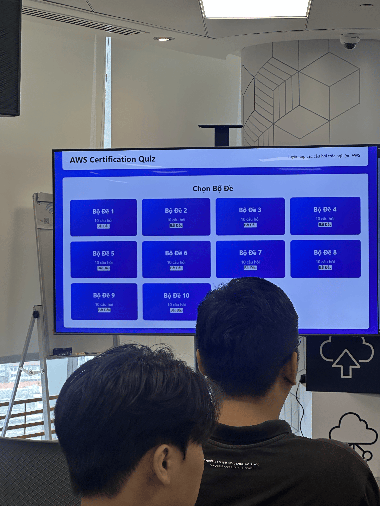

---

title: "Event 4"
date: 2026-07-11
weight: 4
chapter: false
pre: "<b> 4.4. </b>"
--------------------

{}
📌 **Info:** Event report on the Cloud Architect competition, web application security with AWS Security Agent, SLA & Monitoring mindset, and the AWS Certified Cloud Practitioner preparation roadmap.
{}

# Event 4 Reflection Report: Cloud Architect Competition, AWS Security Agent, SLA Monitoring, and AWS Cloud Practitioner Roadmap

### Event Objectives

* Create a practical playground for interns through the final round of the **Cloud Architect** competition.
* Help students reinforce AWS knowledge through scenario-based questions and multiple-choice questions.
* Provide additional perspectives on web application security in a Cloud environment.
* Help students better understand the role of SLA, Monitoring, and Risk Management in system operations.
* Provide guidance on the learning roadmap and preparation strategy for the **AWS Certified Cloud Practitioner** certification.
* Create opportunities for networking, learning, and observing how intern teams present, discuss, and handle technical situations.

### Speakers

* **Thinh Nguyen** 
* **Nguyễn Huỳnh Sơn** 
* **Ngo Le Tan Huy** 
* Two teams in the Cloud Architect final round:

  * **KLKAT**
  * **Ngũ Đại Hiệp**

### Key Highlights

#### Cloud Architect Competition Final Round

One of the main highlights of the event was the final round of the **Cloud Architect** competition, which was organized for the first time for intern teams in the program.

The final round took place between two teams:

* **KLKAT**
* **Ngũ Đại Hiệp**

The competition used **question set number 9**, consisting of 10 questions related to AWS, cloud computing services, and several practical scenarios in system design.

The format was quite straightforward and easy to follow:

* Each question had answer choices in the form of **A, B, C, D**.
* Teams discussed their answers within a limited amount of time.
* After deciding on an answer, each team raised the answer board corresponding to their choice.
* The organizers recorded the results and announced the correct answer after each question.

The questions mainly focused on fundamental knowledge and AWS application thinking, such as:

* Selecting the appropriate service for a given scenario.
* Understanding the role of different AWS service groups.
* Differentiating between deployment or operation models.
* Handling several scenarios related to Cloud architecture.

As the final result, **KLKAT** became the winning team.

This competition created an exciting atmosphere for the event and showed that learning AWS is not only about theory, but also requires the ability to analyze situations, choose suitable services, and respond quickly during the decision-making process.

#### Securing Your Web Apps With AWS Security Agent

The presentation by **Thinh Nguyen** focused on the topic of securing web applications with **AWS Security Agent**.

The opening part pointed out several common issues in traditional security testing:

* **Time-consuming:** Manual pentesting may take several weeks.
* **Expensive:** Hiring specialized security experts can be very costly.
* **Inconsistent:** The quality of testing depends on the skills, experience, and working style of each pentester.
* **High Operational Costs:** Third-party audits may cost from several thousand to tens of thousands of USD per assessment.

From there, the presentation introduced the idea of **Frontier Agent**, an autonomous agent that can support security activities across different stages.

The key points included:

* **Autonomous Reasoning:** The agent is powered by Amazon Bedrock and can plan and execute certain security tasks without continuous manual intervention.
* **Full Lifecycle:** It can support multiple stages such as Design Review, Code Security, and Active Penetration Testing.
* **Verifiable Findings:** Instead of only giving comments like a normal chatbot, the agent can verify vulnerabilities by attempting exploitation in a suitable environment.

##### Design Review

At the design stage, the system can analyze architecture documents or infrastructure code such as Markdown docs or Terraform code.

Some review activities include:

* Checking against standards such as PCI DSS, NIST CSF, or AWS Well-Architected.
* Verifying whether the design meets security requirements.
* Supporting early evaluation before the system is actually deployed.

##### Code Security Review

At the source code development stage, the system can integrate with GitHub or GitLab Pull Requests.

Some notable capabilities include:

* Automatically scanning source code to detect vulnerabilities and secrets.
* Commenting directly on problematic lines of code.
* Suggesting fixes or creating proposed changes through Pull Requests.

##### Automated Pentesting

At the active testing stage, the agent can simulate attacks against a running application.

Some points mentioned include:

* It can test multi-step exploit chains such as IDOR combined with XSS.
* It can authenticate like a real user to test flows behind login.
* It provides an attack graph and verifiable proof of vulnerabilities.

##### Some Limitations to Consider

The presentation also emphasized that automated tools cannot completely replace humans.

Some limitations include:

* **Auth Blocks:** MFA, biometrics, or mTLS can stop the agent from continuing the test.
* **Logic Flaws:** Deep business logic flaws are still difficult to detect without sufficient context.
* **Task-Hour Accumulation:** The more complex the application is, the more processing time it requires, so monitoring is necessary to avoid excessive resource consumption.

From this topic, it can be understood that AI Agents in security are a promising direction, but humans still need to control, evaluate, and define the testing scope appropriately.

#### SLA and Monitoring

The presentation by **Nguyễn Huỳnh Sơn** focused on **SLA** and **Monitoring**.

##### What is SLA?

SLA stands for **Service Level Agreement**, which is a formal agreement on the expected level of service between a provider and a customer.

SLA is important because it helps define:

* Service expectations.
* Provider accountability.
* Risk management methods.
* System performance measurement.

An important point emphasized was that SLA is not only a commitment number, but also directly related to how a system is operated and monitored.

##### From SLA to Monitoring

Monitoring is part of the risk management process. The goal of Monitoring is not only to check whether a server is still running, but also to detect risks early before incidents affect users or become SLA breaches.

The general process includes:

* **Identify risk:** Identify risks such as login failures, SLA breaches, or database dependencies.
* **Monitor signals:** Monitor metrics, logs, and alarms.
* **Respond:** Respond through SNS, SOP, or recovery procedures.
* **Improve:** Review, tune, and prevent similar incidents.

##### Healthy Infrastructure Does Not Mean Happy Users

One notable idea was that a system can show “healthy” infrastructure while users still have a poor experience.

For example:

* CPU, memory, disk, or network may still look normal.
* EC2, RDS, or ALB may still be running.
* However, users may not be able to log in, complete payments, or finish important tasks.

Therefore, Monitoring should look at multiple layers:

* **AWS Services:** EC2, RDS, ALB,...
* **Infrastructure:** CPU, memory, disk, network.
* **Application:** Errors, latency, dependencies.
* **Business Metrics:** Login success rate, order success rate, payment success rate.
* **Customer Journey:** Whether users can log in and complete core actions.

The main message of this part is that AWS can ensure the Cloud infrastructure layer, but the final customer experience is still the responsibility of the team that builds and operates the application.

#### Inside The Exam: AWS Cloud Practitioner

The presentation by **Ngo Le Tan Huy** focused on the preparation roadmap for the **AWS Certified Cloud Practitioner (CLF-C02)** certification.

##### Exam Overview

AWS Certified Cloud Practitioner is a foundational certification that does not require coding or deep system configuration knowledge.

Some key information:

* Number of questions: **65 questions**
* Duration: **90 minutes**
* Non-native English speakers may receive an additional **30 minutes**
* Passing score: **700/1000**
* Certification validity: **3 years**
* Candidates can take the exam at a Pearson VUE testing center or online with remote proctoring.

##### Exam Content Structure

The exam consists of 4 main domains:

* **Domain 1: Cloud Concepts - 24%**
* **Domain 2: Security and Compliance - 30%**
* **Domain 3: Cloud Technology and Services - 34%**
* **Domain 4: Billing, Pricing, and Support - 12%**

##### Cloud Concepts

This section focuses on digital transformation thinking and the benefits of Cloud.

Some important topics include:

* The 6 benefits of AWS Cloud.
* AWS Well-Architected Framework:

  * Operational Excellence
  * Security
  * Reliability
  * Performance Efficiency
  * Cost Optimization
  * Sustainability
* AWS Cloud Adoption Framework:

  * Business group: Business, People, Governance.
  * Technical group: Platform, Security, Operations.

##### Security and Compliance

This section focuses on security and the shared responsibility model.

Important topics include:

* **Shared Responsibility Model:** AWS is responsible for “Security OF the Cloud”, while customers are responsible for “Security IN the Cloud”.
* **IAM:** Understand the Least Privilege principle and the differences between IAM User, Group, Role, and Policy.
* **Infrastructure Security:** Understand the difference between Security Groups and NACLs.
* **Protection Services:** Know the role of AWS Shield and AWS WAF.
* **Compliance:** Understand that AWS Artifact is used to download audit reports.

##### Cloud Technology and Services

This section requires learners to understand AWS services based on use cases.

Some main service groups include:

* **Global Infrastructure:** Region, Availability Zone, Edge Location.
* **Compute:** Amazon EC2, AWS Lambda.
* **Storage & Database:** Amazon S3, EBS, EFS, RDS, DynamoDB.
* **Networking:** Amazon VPC, Route 53.

##### Billing, Pricing, and Support

This section focuses on cost and support.

Some key topics include:

* EC2 pricing models:

  * On-Demand
  * Reserved Instances
  * Spot Instances
* Cost management tools.
* Support plans:

  * Basic
  * Developer
  * Business
  * Enterprise

##### How to Prepare for the Exam

Some preparation methods were shared:

* **Map Keyword Thinking:** When learning a service, associate it with 1–2 representative keywords. For example, when seeing “Decouple/Microservices”, think of SQS.
* **Review Mistakes:** Doing practice tests is not enough; it is important to carefully analyze why the correct answer is correct and why the other options are wrong.
* **Hands-on Practice:** It is recommended to create an AWS Free Tier account and try services such as EC2, S3, IAM,... to better visualize the knowledge.

##### Tips & Tricks

Some exam-taking tips include:

* Use the elimination technique to remove irrelevant answers.
* Do not overthink because the Cloud Practitioner exam focuses on foundational knowledge.
* Pay attention to keywords such as **Not**, **Least cost**, and **Most scalable**.
* If unsure about a question, use the **Flag for review** feature and return to it later.
* Prepare personal identification documents carefully if taking the exam at a Pearson VUE testing center.
* The Pass/Fail result will be displayed immediately after submission, and the detailed score report will be sent by email later.

### What I Learned

#### From the Cloud Architect Competition

* Learning AWS requires combining theory with the ability to handle real scenarios.
* When facing a Cloud problem, it is necessary to identify the correct requirement before selecting a service.
* Team-based competition helps train quick discussion and answer alignment.
* Observing how teams respond provides useful lessons in architecture thinking and solution selection.

#### About Web Application Security

* Manual pentesting can take a lot of time and money.
* AI Agents can support security testing across different stages such as design, code, and pentesting.
* AI should not be considered a complete replacement for security experts.
* Business logic flaws still require humans with system context to evaluate properly.

#### About SLA and Monitoring

* SLA helps clearly define service levels and operational responsibilities.
* Monitoring is not only about tracking CPU, RAM, or server status.
* It is necessary to monitor both user journeys and business metrics.
* Healthy infrastructure does not mean users have a good experience.

#### About AWS Cloud Practitioner

* The Cloud Practitioner certification is suitable for beginners learning AWS.
* The exam focuses on Cloud concepts, security, AWS services, and cost.
* It is better to study by use case instead of only memorizing service names.
* Practice tests should be combined with reviewing mistakes.

### Applications

* When learning AWS, scenario-based questions like those in the Cloud Architect competition can be used for practice.
* When building a project, security should be considered more carefully from the design stage.
* When operating a system, it is important to monitor not only the infrastructure but also the user experience.
* SLA and Monitoring thinking can be applied to the project to identify important metrics that need to be tracked.
* When preparing for AWS certifications, learning should focus on keywords, use cases, and reviewing mistakes.
* Content from the event can be used to support learning direction for the following weeks during the internship.

### Experience

The event provided diverse content, combining competition, technical sharing, and AWS certification learning orientation.

#### Cloud Architect Competition

The final round between **KLKAT** and **Ngũ Đại Hiệp** created an exciting atmosphere for the program. The answer-board format made the competition easy to follow and showed how quickly each team could respond to AWS questions and Cloud scenarios.

#### Web Application Security

The AWS Security Agent topic helped illustrate the trend of using AI Agents in security testing. This topic showed that security is not only a final checking step, but should be integrated into the entire software development lifecycle.

#### SLA and Monitoring

The SLA and Monitoring session helped clarify that system operation is not only about keeping servers running. More importantly, users must be able to perform key actions such as logging in, submitting data, or completing tasks.

#### AWS Cloud Practitioner

The AWS Cloud Practitioner sharing session was useful for students who are learning AWS at a foundational level. It helped clarify the exam structure, how to study, and what mistakes to avoid during the exam.

#### Lessons Learned

* AWS should be learned through practical scenarios.
* Security should be included from the design stage.
* Monitoring should be connected to user experience.
* Certification preparation should focus on keywords, use cases, and mistake analysis.
* When attending technical events, it is not necessary to understand every advanced detail immediately, but it is important to capture the main ideas for further learning.

#### Images

> The event provided practical perspectives on the Cloud Architect competition, web application security, system operations mindset, and AWS certification learning orientation for students during the internship.
